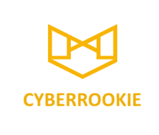

# [CyberRookie](https://github.com/luorshi/CyberRookie) 

**CyberRookie Project is a 8 weeks self-Studing project.**

**Our goals**
Our goals are helping people with limited IT/Cyber background into IT/Cyber field can:
1. Learning cyber skills from free online resource and open-source security softwares
2. Learning cyber skills from cybersecurity best practices
3. Learning cyber skills by building a homeLab

**Learning Objects**
The Learning Objects iniclude:
1. Virtualization, Network/System Administration
2. Secure Architecture
3. Firewall, IDS/IPS
4. Secuirty Hardening
5. Prevention, Detection & Response
6. Log & Monitoring System
7. Risk Assessment
8. Vulnerability Assessment
9. Security control & Cybersecurity Best Practices
10. Audit Process

**Project Overview**

** The course presentation is in https://github.com/trevor-shi/CyberRookie-Project/tree/master/CyberRookie%20Project **

**We welcome new friends to learn cybersecurity together!**
